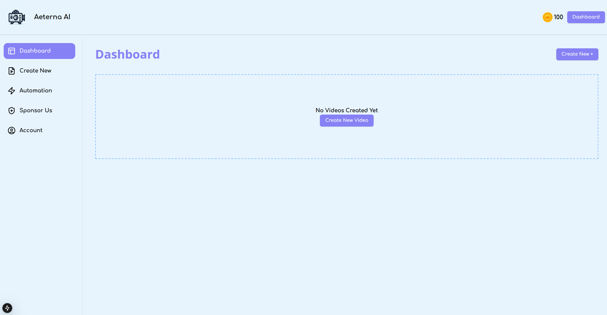
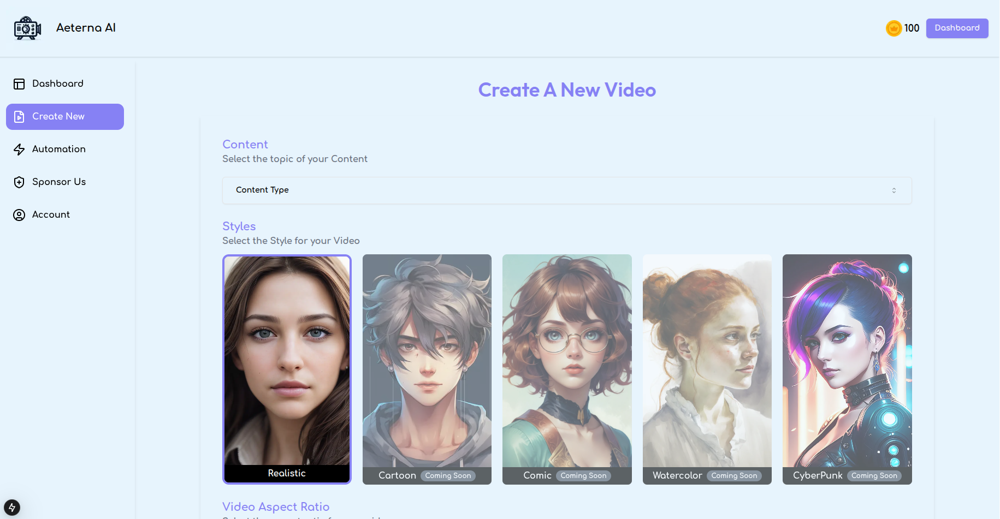
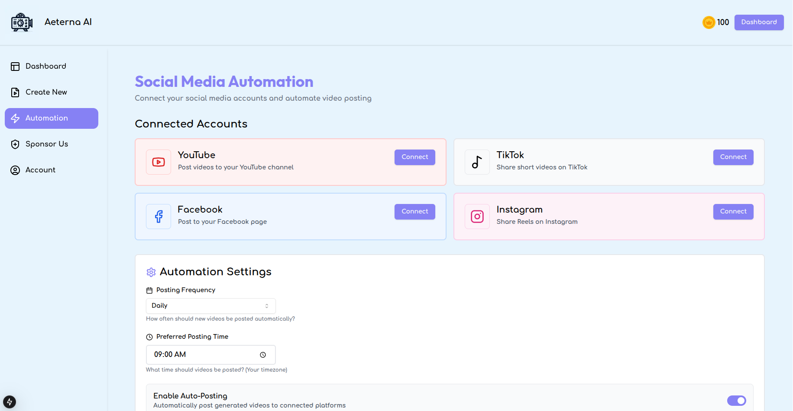

# 🎬 Aeterna AI - AI-Powered Video Generation Platform


**Aeterna AI** is a powerful open-source platform that generates professional-quality videos automatically using AI. Simply provide a topic or script, and Aeterna will create engaging videos complete with AI-generated scripts, voiceovers, relevant video clips, and subtitles.

## ✨ Features

- 🤖 **AI Script Generation** - Powered by Google Gemini, OpenAI, DeepSeek, or local models
- 🎙️ **Natural Voice Synthesis** - 50+ voices in multiple languages using Edge TTS
- 🎥 **Automatic Video Assembly** - Finds and combines relevant video clips from Pixabay/Pexels
- 📝 **Auto Subtitles** - Synchronized subtitles with customizable styles
- 🎨 **Multiple Video Styles** - Realistic (with more coming soon)
- 📱 **Multiple Aspect Ratios** - Portrait (9:16), Landscape (16:9), Square (1:1)
- ⚡ **Fast API Backend** - Built with FastAPI for high performance
- 🎯 **Modern Dashboard** - Beautiful Next.js frontend with real-time generation tracking
- 🔄 **Social Media Automation** - Connect and schedule posts to YouTube, TikTok, Facebook, Instagram

## 📸 Screenshots

### Dashboard


### Video Creation Interface


### Automation Hub


## 🚀 Quick Start

### Prerequisites

- **Python 3.12+** (for backend)
- **Node.js 18+** (for frontend)
- **FFmpeg** (for video processing)
- **ImageMagick** (for subtitle rendering)
- API keys for at least one LLM provider (Gemini recommended) and one video source (Pixabay recommended)

### Installation

#### 1. Clone the Repository

```bash
git clone https://github.com/Theideabased/aeterna.git
cd aeterna
```

#### 2. Backend Setup (FastAPI)

```bash
# Navigate to API directory
cd api

# Create virtual environment
python -m venv venv

# Activate virtual environment
# On Linux/Mac:
source venv/bin/activate
# On Windows:
# venv\Scripts\activate

# Install dependencies
pip install -r requirements.txt

# Copy example env file and configure
cp .env.example .env
nano .env  # or use your preferred editor
```

**Configure your `.env` file:**

```env
# Choose your LLM provider
LLM_PROVIDER=gemini

# Add your API keys (get them from the links below)
GEMINI_API_KEY=your_gemini_api_key_here
PIXABAY_API_KEYS=your_pixabay_key_here

# Server configuration
LISTEN_HOST=0.0.0.0
LISTEN_PORT=8080
```

**Where to get API keys:**
- **Gemini API** (Free): https://aistudio.google.com/app/apikey
- **Pixabay API** (Free): https://pixabay.com/api/docs/
- **Pexels API** (Free): https://www.pexels.com/api/

#### 3. Frontend Setup (Next.js)

Open a new terminal:

```bash
# Navigate to frontend directory
cd frontend

# Install dependencies
npm install

# Configure environment
echo "API_BASE_URL=http://localhost:8080" > .env.local

# Start development server
npm run dev
```

#### 4. Start the Application

**Terminal 1 - Backend:**
```bash
cd api
source venv/bin/activate  # On Windows: venv\Scripts\activate
python main.py
```

The API will be available at:
- API: http://localhost:8080
- API Docs: http://localhost:8080/docs

**Terminal 2 - Frontend:**
```bash
cd frontend
npm run dev
```

The dashboard will be available at:
- Dashboard: http://localhost:3000

## 🎥 How to Use

### Creating Your First Video

1. **Open the Dashboard**
   - Navigate to http://localhost:3000
   - Click on "Create New" in the sidebar

2. **Enter Your Topic**
   - Type your video topic (e.g., "Top 5 Travel Destinations in Europe")
   - Or write a custom script

3. **Configure Settings**
   - **Video Aspect**: Choose portrait (9:16), landscape (16:9), or square (1:1)
   - **Voice**: Select from 50+ natural voices
   - **Duration**: Set video length (15-60 seconds recommended)
   - **Video Source**: Choose Pixabay or Pexels
   - **Style**: Select "Realistic" (more styles coming soon)

4. **Generate**
   - Click "Generate Video"
   - Watch the progress in real-time
   - Your video will be ready in 30-90 seconds!

5. **Download & Share**
   - Download your video from the dashboard
   - Share directly or schedule posts via Automation

### Using Custom Scripts

If you want full control over the content:

1. Enable "Write Your Own Prompt"
2. Enter your custom topic description
3. Write your complete video script
4. Generate the video with your script

## 📁 Project Structure

```
aeterna/
├── api/                          # Backend (FastAPI)
│   ├── app/
│   │   ├── controllers/          # API endpoints
│   │   │   └── v1/
│   │   │       ├── llm.py        # LLM generation
│   │   │       └── video.py      # Video generation
│   │   ├── services/             # Business logic
│   │   │   ├── llm.py           # LLM integration
│   │   │   ├── material.py      # Video clip fetching
│   │   │   ├── subtitle.py      # Subtitle generation
│   │   │   ├── voice.py         # TTS integration
│   │   │   └── video.py         # Video assembly
│   │   ├── models/              # Data models
│   │   └── config/              # Configuration
│   ├── main.py                  # Entry point
│   ├── requirements.txt         # Python dependencies
│   └── .env.example            # Environment template
│
├── frontend/                    # Frontend (Next.js)
│   ├── app/
│   │   ├── dashboard/          # Main dashboard
│   │   │   ├── create-new/    # Video creation UI
│   │   │   ├── automation/    # Social media automation
│   │   │   └── sponsor/       # Sponsorship page
│   │   └── page.jsx           # Landing page
│   ├── components/            # Reusable components
│   ├── public/               # Static assets
│   └── package.json          # Node dependencies
│
└── screenshots/              # UI screenshots
```

## 🔧 Configuration

### Backend Configuration (`.env`)

```env
# LLM Provider (choose one)
LLM_PROVIDER=gemini              # Options: gemini, openai, deepseek, qwen

# API Keys
GEMINI_API_KEY=your_key          # Google Gemini
OPENAI_API_KEY=your_key          # OpenAI (optional)
DEEPSEEK_API_KEY=your_key        # DeepSeek (optional)

# Video Sources (at least one required)
PIXABAY_API_KEYS=your_key        # Pixabay (recommended)
PEXELS_API_KEYS=your_key1,your_key2  # Pexels (optional)

# Server Configuration
LISTEN_HOST=0.0.0.0
LISTEN_PORT=8080
```

### Frontend Configuration (`.env.local`)

```env
API_BASE_URL=http://localhost:8080
```

## 🎨 Available Voices

Aeterna includes 50+ natural-sounding voices:

**English:**
- en-US-AnaNeural (Female)
- en-US-ChristopherNeural (Male)
- en-GB-SoniaNeural (Female, British)
- en-AU-NatashaNeural (Female, Australian)
- And many more...

**Other Languages:**
- Spanish (es-ES, es-MX)
- French (fr-FR)
- German (de-DE)
- Portuguese (pt-BR)
- And 10+ more languages!

## 🤝 Contributing

We welcome contributions! Here's how you can help:

1. **Fork the repository**
2. **Create a feature branch**: `git checkout -b feature/amazing-feature`
3. **Commit your changes**: `git commit -m 'Add amazing feature'`
4. **Push to the branch**: `git push origin feature/amazing-feature`
5. **Open a Pull Request**

### Areas Where We Need Help

- 🎨 Adding new video styles (Cartoon, Comic, Anime)
- 🌍 Multi-language support
- 🔌 Additional video source integrations
- 📱 Mobile app development
- 📖 Documentation improvements
- 🐛 Bug fixes and testing

## 💖 Support the Project

Aeterna is free and open-source. If you find it useful, consider supporting its development:

- ☕ **Buy Me a Coffee**: [Support on Buy Me a Coffee](https://buymeacoffee.com/yourusername)
- ⭐ **Star the Repository**: Help others discover Aeterna
- 🐛 **Report Bugs**: Help us improve
- 💡 **Suggest Features**: Share your ideas

Visit our [Sponsor Page](http://localhost:3000/dashboard/sponsor) in the dashboard to learn more!

## 🔒 Security

**Important**: Never commit your `.env` file to git! It contains sensitive API keys.

- Use `.env.example` as a template
- Keep your API keys secret
- Regenerate keys if accidentally exposed
- Use environment-specific `.env` files

## 📝 API Documentation

Once the backend is running, visit:
- **Interactive API Docs**: http://localhost:8080/docs
- **OpenAPI Spec**: http://localhost:8080/openapi.json

### Main Endpoints

#### Generate Video
```bash
POST /api/v1/videos
Content-Type: application/json

{
  "video_subject": "Amazing sunset timelapse",
  "video_aspect": "16:9",
  "voice_name": "en-US-AnaNeural",
  "video_concat_mode": "random",
  "video_count": 5,
  "video_source": "pixabay",
  "video_language": "en",
  "video_duration": 30
}
```

#### Check Task Status
```bash
GET /api/v1/tasks/{task_id}
```

## 🐛 Troubleshooting

### Common Issues

**1. FFmpeg not found**
```bash
# Ubuntu/Debian
sudo apt-get install ffmpeg

# macOS
brew install ffmpeg

# Windows
# Download from https://ffmpeg.org/download.html
```

**2. ImageMagick not found**
```bash
# Ubuntu/Debian
sudo apt-get install imagemagick

# macOS
brew install imagemagick

# Windows
# Download from https://imagemagick.org/script/download.php
```

**3. Port already in use**
```bash
# Change port in api/.env
LISTEN_PORT=8081

# Update frontend/.env.local
API_BASE_URL=http://localhost:8081
```

**4. API key errors**
- Verify your keys are correctly set in `api/.env`
- Check API key quotas and limits
- Ensure no extra spaces in the `.env` file

**5. Video generation fails**
- Check your internet connection
- Verify video source API keys are valid
- Check API rate limits
- Review logs in terminal for specific errors

## 📚 Technology Stack

### Backend
- **FastAPI** - Modern Python web framework
- **MoviePy** - Video editing and assembly
- **Edge TTS** - Text-to-speech synthesis
- **Google Gemini** - AI script generation
- **Pixabay/Pexels API** - Video clip sources
- **Uvicorn** - ASGI server

### Frontend
- **Next.js 14** - React framework
- **Tailwind CSS** - Styling
- **Framer Motion** - Animations
- **Spline 3D** - 3D backgrounds
- **Axios** - API communication
- **Lucide Icons** - Icon library

## 📄 License

This project is licensed under the MIT License - see the [LICENSE](LICENSE) file for details.

## 🙏 Acknowledgments

- Google Gemini for AI capabilities
- Edge TTS for natural voice synthesis
- Pixabay and Pexels for video materials
- MoviePy for video processing
- The open-source community

## 🔗 Links

- **GitHub**: https://github.com/Theideabased/aeterna
- **Issues**: https://github.com/Theideabased/aeterna/issues
- **Discussions**: https://github.com/Theideabased/aeterna/discussions

## 📞 Contact

For questions, suggestions, or support:
- Open an issue on GitHub
- Join our community discussions
- Visit the Sponsor page to support development

---

**Made with ❤️ by the Aeterna community**

*Start creating amazing AI-powered videos today!* 🎬✨
